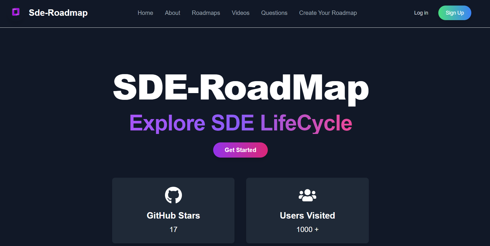

# 🛠️ Collaboration API Repository for SDE-Roadmap Platform (Alpha V1)

Welcome to the **SDE-Roadmap** collaboration repository! This project is currently in its Alpha stage (V1) and aims to provide a comprehensive roadmap for aspiring software engineers. We encourage contributions from developers to enhance and expand the platform.



## 🚀 How to Collaborate

We believe in open-source contributions that make learning and growing as a Software Developer more accessible. Here’s a simple guide on how to collaborate with us.

### Project Structure

The repository follows a straightforward structure to maintain clarity and organization. Here’s how the project is laid out:

```bash
├── data
│   └── domain-folder
│       └── <Your-Contribution>
│           └── <content-and-documents>
```

Steps to Collaborate:
1.Fork the Repository: Start by forking this repository to your GitHub account. This allows you to make changes to the project independently.

2.Clone the Repository: Once forked, clone the repository to your local machine.

``` bash
git clone https://github.com/your-username/SDE-Roadmap.git
cd SDE-Roadmap

```

3.Navigate to the Appropriate Domain Folder:

Inside the data folder, find the domain folder that is relevant to your contribution (for example: frontend, backend, cloud, etc.).
Add your content and documents to this domain folder. Make sure the folder structure is consistent with the current project setup.

4.Add or Modify Content:

Add new content or improve existing documents within the domain folder.
Ensure the content is structured and formatted in Markdown for consistency.

5.Push Changes:

Once you’ve made your changes, push them to your forked repository.


```bash
git add .
git commit -m "Added/Modified content for <domain>"
git push origin main

```

6. Submit a Pull Request:

After pushing the changes, create a Pull Request (PR) to the original repository. The maintainers will review the PR and provide feedback or merge it into the main branch.


That’s it! 🎉

Contribution Tips
Follow the Markdown syntax for easy readability and to keep the documentation uniform.
If contributing code snippets, make sure to include comments and explanations.
Provide clear and concise content for users at various levels (Beginner, Intermediate, Advanced).
Keep the roadmap updated with current technologies and best practices.


Contribution Example
Here's an example of how to structure your content within a domain folder:


```
├── data
│   └── frontend
│       └── React_Basics.md
│       └── Advanced_React.md

```

Hello 
You can also break it down by specific technologies, tutorials, or learning paths within a domain.

We value all contributions, whether big or small, and look forward to building the SDE-Roadmap together! Let’s help aspiring software developers navigate their learning journey.

📞 Contact Us
For any questions or issues, feel free to raise an issue or contact the maintainers.
